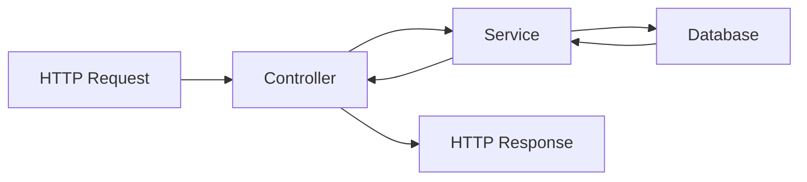

The NestJS CRUD framework (`@nestjsx/crud`) is a microframework for building full-featured RESTful APIs with minimal boilerplate. It provides a declarative approach to creating CRUD endpoints with powerful query capabilities, validation, and database integration.

## Three-layer architecture

The framework follows a clean three-layer architecture that separates concerns and keeps your code maintainable:



<CardGroup cols={3}>
  <Card title="Controllers" icon="router" href="/concepts/controllers">
    Define API endpoints using the `@Crud()` decorator
  </Card>
  <Card title="Services" icon="database" href="/concepts/services">
    Handle business logic and database operations
  </Card>
  <Card title="Requests" icon="search" href="/concepts/requests">
    Parse and validate query parameters
  </Card>
</CardGroup>

## Key features

### Automatic endpoint generation

The `@Crud()` decorator automatically generates up to 8 RESTful endpoints:

- `GET /resource` - Get many resources with filtering, pagination, and sorting
- `GET /resource/:id` - Get one resource by ID
- `POST /resource` - Create one resource
- `POST /resource/bulk` - Create many resources
- `PATCH /resource/:id` - Update one resource (partial)
- `PUT /resource/:id` - Replace one resource (full)
- `DELETE /resource/:id` - Delete one resource
- `PATCH /resource/:id/recover` - Recover soft-deleted resource

<Note>
The `recoverOneBase` endpoint is only available when `softDelete: true` is enabled in query options.
</Note>

### Rich query capabilities

Clients can use powerful query parameters to control responses:

```bash
# Select specific fields
GET /companies?fields=name,domain

# Filter with operators
GET /companies?filter=name||$cont||Tech

# Join relations
GET /companies?join=users&join=projects

# Sort results
GET /companies?sort=name,ASC

# Paginate
GET /companies?page=1&limit=10
```

### Built-in validation

The framework integrates with `class-validator` and `class-transformer` to validate incoming data using validation groups:

```typescript
import { CrudValidationGroups } from '@nestjsx/crud';
import { IsString, IsNotEmpty, IsOptional } from 'class-validator';

const { CREATE, UPDATE } = CrudValidationGroups;

@Entity('companies')
export class Company {
  @IsOptional({ groups: [UPDATE] })
  @IsNotEmpty({ groups: [CREATE] })
  @IsString({ always: true })
  @Column()
  name: string;
}
```

### Database agnostic

While `@nestjsx/crud-typeorm` provides TypeORM integration, the core framework is database agnostic. You can extend the base `CrudService` class to work with any database or ORM.

## Packages

The framework consists of three main packages:

<CardGroup cols={3}>
  <Card title="@nestjsx/crud" icon="package">
    Core package with decorators, interfaces, and route generation
  </Card>
  <Card title="@nestjsx/crud-typeorm" icon="database">
    TypeORM integration with `TypeOrmCrudService`
  </Card>
  <Card title="@nestjsx/crud-request" icon="code">
    Request parsing and query building utilities
  </Card>
</CardGroup>

## Quick example

Here's a minimal example showing all three layers:

```typescript
// company.entity.ts
import { Entity, Column, PrimaryGeneratedColumn } from 'typeorm';

@Entity('companies')
export class Company {
  @PrimaryGeneratedColumn()
  id: number;

  @Column()
  name: string;

  @Column()
  domain: string;
}
```

```typescript
// companies.service.ts
import { Injectable } from '@nestjs/common';
import { InjectRepository } from '@nestjs/typeorm';
import { TypeOrmCrudService } from '@nestjsx/crud-typeorm';
import { Company } from './company.entity';

@Injectable()
export class CompaniesService extends TypeOrmCrudService<Company> {
  constructor(@InjectRepository(Company) repo) {
    super(repo);
  }
}
```

```typescript
// companies.controller.ts
import { Controller } from '@nestjs/common';
import { Crud } from '@nestjsx/crud';
import { Company } from './company.entity';
import { CompaniesService } from './companies.service';

@Crud({
  model: { type: Company },
  query: {
    alwaysPaginate: false,
  },
})
@Controller('companies')
export class CompaniesController {
  constructor(public service: CompaniesService) {}
}
```

<Tip>
The service must be a public property named `service` for the framework to automatically wire up the CRUD operations.
</Tip>

With just these three files, you get a fully functional REST API with filtering, sorting, pagination, validation, and Swagger documentation!

## Next steps

<CardGroup cols={2}>
  <Card title="Controllers" icon="router" href="/concepts/controllers">
    Learn how to configure CRUD controllers
  </Card>
  <Card title="Services" icon="database" href="/concepts/services">
    Understand CRUD services and database operations
  </Card>
  <Card title="Requests" icon="search" href="/concepts/requests">
    Master query parameters and filtering
  </Card>
  <Card title="Quick start" icon="rocket" href="/quickstart">
    Get started with a complete example
  </Card>
</CardGroup>
